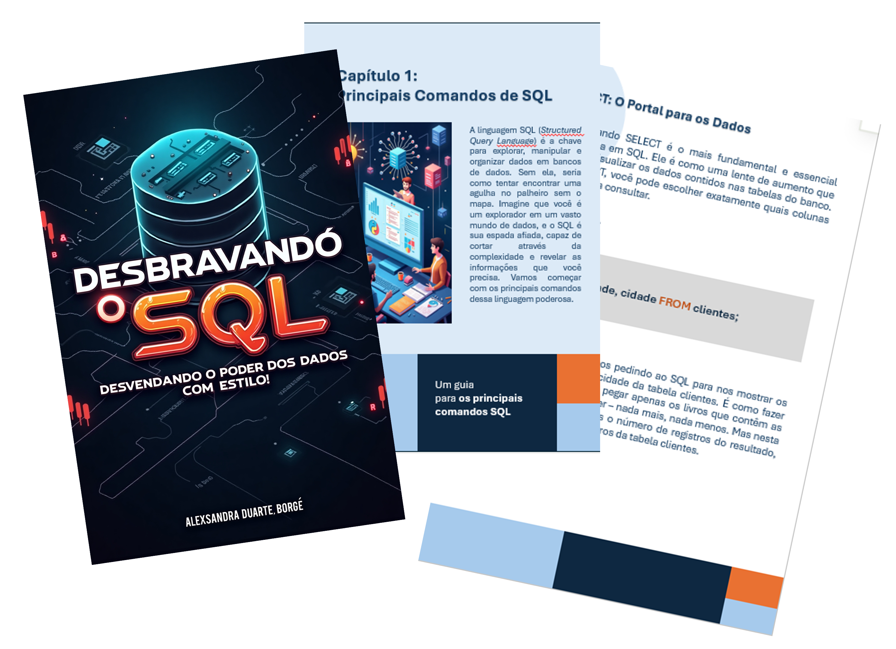

    

-------

# Projeto EBOOK Gerado por I.A.s

Projeto com o objetivo de gerar um ebook com as facilidades das ferramentas de IA. A descrição do projeto, prompts e ferramentas utilizadas seguem abaixo:

## 📝 Descrição

Este e-book de 15 páginas que aborda os principais comandos SQL. [./output/ebook_sql.pdf]()

## 🤖 Tecnologias Utilizadas

- IA Generativa **[ChatGPT](https://chat.openai.com)** para roteirização;
- IA Generativa **[Leonardo AI](https://leonardo.ai)** para criar a arte visual do e-book;
- Ferramenta **Microsoft PowerPoint** para edição.

## 🧠 Prompts

# Projeto EBOOK Gerado por I.A.s

Projeto com o objetivo de gerar um ebook com as facilidades das ferramentas de IA. A descrição do projeto, prompts e ferramentas utilizadas seguem abaixo:

## 📝 Descrição

Este e-book de 15 páginas que aborda os principais comandos SQL. [LINK PARA O E-BOOK AQUI](https://github.com/aledborges/prompts-recipe-to-create-a-ebook/blob/main/output/ebook_sql.pdf)

## 🤖 Tecnologias Utilizadas

- IA Generativa **[ChatGPT](https://chat.openai.com)** para roteirização;
- IA Generativa **[Leonardo AI](https://leonardo.ai)** para criar a arte visual do e-book;
- Ferramenta **Microsoft PowerPoint** para edição.

## 🧠 Prompts

ChatGPT：

### Título
Crie um título de um ebook sobre "Introdução a Linguagem SQL” é do nicho de programação, o título deve ser curto e divertido. Liste 5 variações de títulos                                                        |
### Conteúdo
Atue como um programador sênior e me escreva um ebook sobre "Introdução a Linguagem SQL”, com o título “Desbravando o SQL: Desvendando o Poder dos Dados com Estilo!” em um estilo mais formal. Agora escreva conforme o {ROTEIRO} e seguindo as {REGRAS}. 

{ROTEIRO}
 

Principais comandos de SQL 
Como combinar os comandos e unir dados de mais de uma tabela 

{REGRAS}

> Mantenha o tom e o ritmo, mas reescreva as palavras em {ROTEIRO}
 

> Use analogias simples e hipérboles

> Escreva com uma emoção entusiasta e incentivadora > Escreva pelo menos 1000 palavras 

> divida o texto entre os dois itens do {ROTEIRO} que serão os capítulos e crie tópicos em cada capítulos 

> escreva para desenvolvedores júniors e entusiastas de tecnologia

Leonardo AI：

|  Ação  | prompt                                                                                 |
| :----: | -------------------------------------------------------------------------------------- |
| capa | crie a capa para o ebook "Desbravando o SQL: Desvendando o Poder dos Dados com Estilo!" sobre SQL, programação e banco de dados. Autor Alexsandra Duarte Borges |
| Outras | crie imagens para o ebook "Desbravando o SQL: Desvendando o Poder dos Dados com Estilo!" sobre SQL, programação e banco de dados. diferentes formas de representar a consulta a dados |

## ✨ Features

- Conteúdo gerado via ChatGPT
- Imagens geradas via Leonardo AI

## 📚 Materiais

- Imagens utilizadas em `assets`
- ebook gerado em `output`
